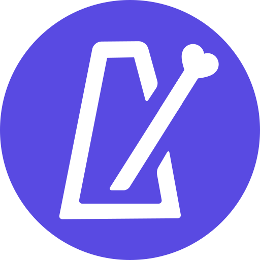

  

<h1 align="center">Metrobones</h1>

A precision metronome Progressive Web App built with Blazor WebAssembly, MudBlazor and the Web Audio API.  
**Live app: [knerten0815.github.io/metrobones](https://knerten0815.github.io/metrobones/)**

---

## Overview

Metrobones is designed for my drummer "Bones", who complained at rehearsal, that there are so many metronome apps in the iOS app store, but not a single one features clicktracks (which musicians use for songs with varying tempo or time signatures). I saw it as a good excuse to deepen my knowledge in cross-platform mobile app development, while simultaneously creating something that might actually be used by people. Soon after I learned about Apples annual developer fee and decided to deepen my knowledge in web development and Progressive Web Apps instead...

---

## Features

- **Precise click playback** via Web Audio API lookahead scheduling
- **Visual feedback** highlighting the current beat
- **Tap tempo** with rolling average over the last 8 taps
- **Time signature support** allows selecting beats-per-bar (1–32) and note value (1, 2, 4, 8, 16)
- **Custom Beat Accenting** - mute some beats for practice or accent subdivisions in odd time signatures
- **Installable PWA** - add to home screen and use offline on Android and iOS

### Planned

- Creating and saving clicktracks
- Alternative click sounds
- Export clicktracks as MIDI
- Notification controls via Media Session API
- Native Android app
- Setlists

---

## Tech Stack

- [Blazor WebAssembly](https://dotnet.microsoft.com/en-us/apps/aspnet/web-apps/blazor) (.NET 9)
- Web Audio API — audio scheduling and click synthesis
- [MudBlazor UI](https://mudblazor.com/)
- Hosted on [Github Pages](https://knerten0815.github.io/metrobones/)

---

## License

MIT